---
## Front matter
title: "Лабораторная работа №6."
subtitle: "Арифметические операции в NASM."
author: "Самарханова Полина Тимуровна"

## Generic otions
lang: ru-RU
toc-title: "Содержание"

## Bibliography
bibliography: bib/cite.bib
csl: pandoc/csl/gost-r-7-0-5-2008-numeric.csl

## Pdf output format
toc: true # Table of contents
toc-depth: 2
lof: true # List of figures
lot: true # List of tables
fontsize: 12pt
linestretch: 1.5
papersize: a4
documentclass: scrreprt
## I18n polyglossia
polyglossia-lang:
  name: russian
  options:
	- spelling=modern
	- babelshorthands=true
polyglossia-otherlangs:
  name: english
## I18n babel
babel-lang: russian
babel-otherlangs: english
## Fonts
mainfont: PT Serif
romanfont: PT Serif
sansfont: PT Sans
monofont: PT Mono
mainfontoptions: Ligatures=TeX
romanfontoptions: Ligatures=TeX
sansfontoptions: Ligatures=TeX,Scale=MatchLowercase
monofontoptions: Scale=MatchLowercase,Scale=0.9
## Biblatex
biblatex: true
biblio-style: "gost-numeric"
biblatexoptions:
  - parentracker=true
  - backend=biber
  - hyperref=auto
  - language=auto
  - autolang=other*
  - citestyle=gost-numeric
## Pandoc-crossref LaTeX customization
figureTitle: "Рис."
tableTitle: "Таблица"
listingTitle: "Листинг"
lofTitle: "Список иллюстраций"
lolTitle: "Листинги"
## Misc options
indent: true
header-includes:
  - \usepackage{indentfirst}
  - \usepackage{float} # keep figures where there are in the text
  - \floatplacement{figure}{H} # keep figures where there are in the text
---

# Цель работы
Освоение арифметических инструкций языка ассемблера NASM.


# Задание
Символьные и численные данные в NASM
Выполнение арифметических операций в NASM
Задания для самостоятельной работы

# Теоретическое введение

Большинство инструкций на языке ассемблера требуют обработки операндов. Адрес опе-
ранда предоставляет место, где хранятся данные, подлежащие обработке. Это могут быть
данные хранящиеся в регистре или в ячейке памяти. Далее рассмотрены все существующие
способы задания адреса хранения операндов – способы адресации.
Существует три основных способа адресации:
• Регистровая адресация – операнды хранятся в регистрах и в команде используются
имена этих регистров, например: mov ax,bx.
• Непосредственная адресация – значение операнда задается непосредственно в ко-
манде, Например: mov ax,2.
• Адресация памяти – операнд задает адрес в памяти. В команде указывается символи-
ческое обозначение ячейки памяти, над содержимым которой требуется выполнить
операцию.


# Выполнение лабораторной работы
## Символьные и численные данные в NASM

 С помощью команды mkdir я создала новую директорию,в которой далее создавала файлы с программами во время всей лабораторной работы №6 (рис. @fig:001).

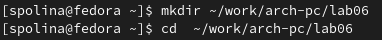{#fig:001 width=70%}

Далее я создала файл lab6-1.asm,используя команду"touch" (рис. @fig:002).

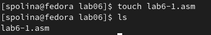{#fig:002 width=70%}

Скопировала в созданный каталог файл in_out.asm,т.к он использовался и в других программах (рис. @fig:003).

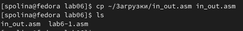{#fig:003 width=70%}

После я открыла файл lab6-1.asm в nano и вставила в него программу ввода значения регистра eax (рис. @fig:004).

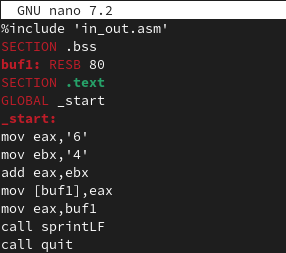{#fig:004 width=70%}

Далее я создала объектный файл и после его компановки запустила программу (рис. @fig:005). Программа вывела символ "j", т.к программа вывела символ, который соответствует в системе ASCII сумме двоичных символов 4 и 6.

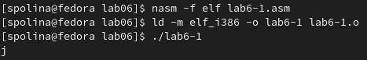{#fig:005 width=70%}

После я изменила символы '6' и '4' на цифры 6 и 4 (рис. @fig:006).

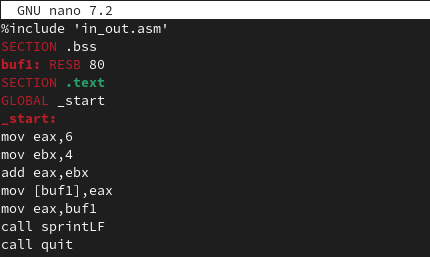{#fig:006 width=70%}
`
Далее я создала новый исполняемый файл и запустила программу (рис. @fig:007). Программа вывела символ с кодом 10,это символ перевода строки, он не отображается при выводе на экран.

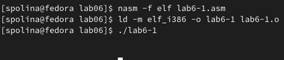{#fig:007 width=70%}

После я создала новый файл под названием lab6-2.asm и проверила его наличие(рис. @fig:008).

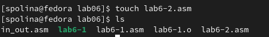{#fig:008 width=70%}

После я ввела в файл текст уже другой программы для вывода eax (рис. @fig:009).

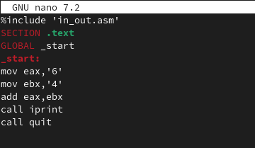{#fig:009 width=70%}

Я создала и запустила исполняемый файл lab6-2 (рис. @fig:010). Программа стала выводить 106, т.к программа выводит именно число,не символ, хотя всё еще происходит сложение кодов символов "6" и "4".

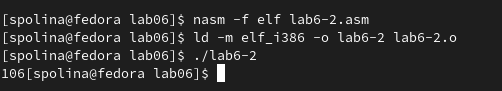{#fig:010 width=70%}

Я заменила в тексте данной программы символы '4' и '6' на числа 6 и 4 (рис. @fig:011).

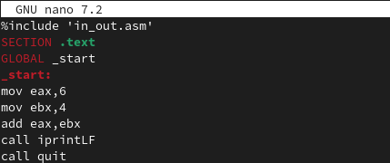{#fig:011 width=70%}

Снова создала исполняемый файл программы lab6-2 (рис. @fig:012). Теперь программа складывала именно числа,поэтому выводом является сумма 4+6,которая равна 10.

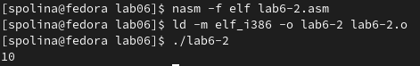{#fig:012 width=70%}

После я заменила в тексте программы функцию iprintLF на iprint (рис. @fig:013).

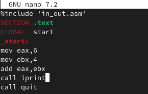{#fig:013 width=70%}

Создала и запустила исполняемый файл (рис. @fig:014).

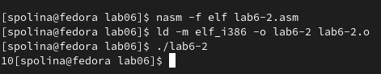{#fig:014 width=70%}

## Выполнение арифметических операций в NASM

Я создала файл,назвала его lab6-3.asm, используя команду touch (рис. @fig:015).

{#fig:015 width=70%}

Далее я ввела в созданный файл текст программы для вычисления значения выражения f(x)=(5*2+3)/3 (рис. @fig:016).

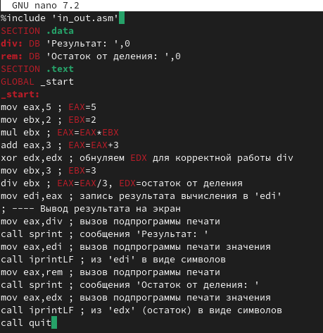{#fig:016 width=70%}

Запустила созданный исполняемый файл (рис. @fig:017).

{#fig:017 width=70%}

Изменила программу так, чтобы она вычисляла другое выражение f(x)=(4*6+2)/5 (рис. @fig:018).

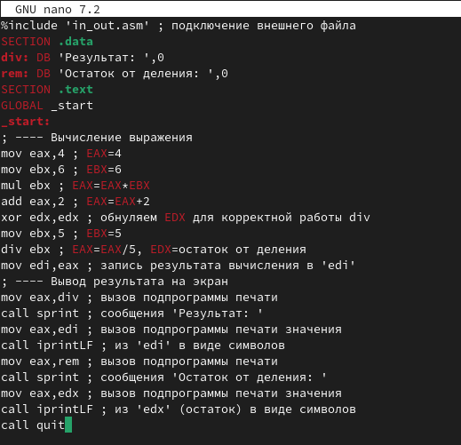{#fig:018 width=70%}

Далее я создала исполняемый файл и запустила программу (рис. @fig:019). Программа посчитала выражение правильно.

{#fig:019 width=70%}

После создала новый файл variant.asm (рис. @fig:020).

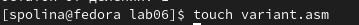{#fig:020 width=70%}

Ввела в файл текст программы, который вычисляет задания по номеру студенческого билета (рис. @fig:021).

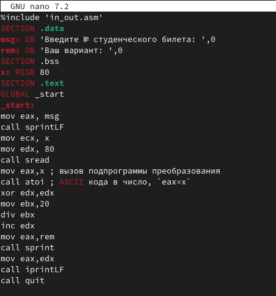{#fig:021 width=70%}

Создала исполняемый файл и запустила программу (рис. @fig:022). Ввела номер своего студенческого

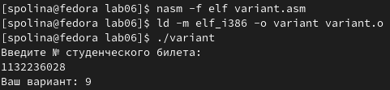{#fig:022 width=70%}

### Ответы на вопросы
1. За вывод сообщения "Ваш вариант" отвечают строчки кода
```NASM
mov eax,rem
call sprint
```

2. Инструкция mov ес, х используется, чтобы положить адрес вводимой строки х в регистр есх mov edx, 80 - запись в регистр edx длины вводимой строки call sread - вызов подпрограммы из внешнего файла, обеспечивающей ввод сообщения с клавиатуры
3. call atoi используется для вызова подпрограммы из внешнего файла, которая преобразует ascii-код символа в целое число и записывает результат в регистр eax

4. За вычисления варианта отвечают строки:
```NASM
хот edx,edx ; обнуление еах для корректной работы div
mov ebx, 20 ; ebx = 20
div ebx; eax = eax/20, edx - остаток от деления
inc edx; edx = edx + 1
```

5. При выполнении инструкции div ebx остаток от деления записывается в регистр edx

6. Инструкция inc edx увеличивает значение регистра edx на 1

7. За вывод на экран результатов вычислений отвечают строки:
```NASM
mov eax,edx
call iprintLF
```

## Задания для самостоятельной работы
Я создала файл lab6-4.asm,используя команду touch (рис. @fig:023).

{#fig:023 width=70%}

Открыла файл, ввела в него выражения №9 (рис. @fig:024). 

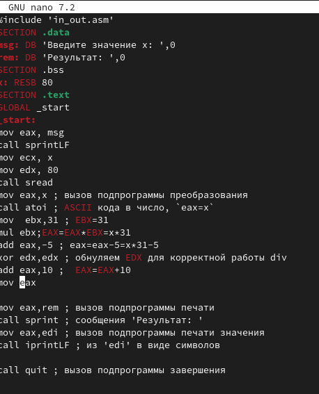{#fig:024 width=70%}

После создала исполняемый файл и запустила программу (рис. @fig:025). Программа вывела правильный ответ.

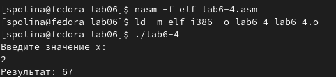{#fig:025 width=70%}


# Выводы

При выполнении данной лабораторной работы я освоила арифметические инструкции языка ассемблера NASM.

# Список литературы{.unnumbered}

1. Лабораторная работа №6
2. Таблица ASCII
