---
## Front matter
title: "Лабораторная работа №7"
subtitle: " Команды безусловного и
условного переходов в Nasm. Программирование
ветвлений."
author: "Самарханова Полина Тимуровна"

## Generic otions
lang: ru-RU
toc-title: "Содержание"

## Bibliography
bibliography: bib/cite.bib
csl: pandoc/csl/gost-r-7-0-5-2008-numeric.csl

## Pdf output format
toc: true # Table of contents
toc-depth: 2
lof: true # List of figures
lot: true # List of tables
fontsize: 12pt
linestretch: 1.5
papersize: a4
documentclass: scrreprt
## I18n polyglossia
polyglossia-lang:
  name: russian
  options:
	- spelling=modern
	- babelshorthands=true
polyglossia-otherlangs:
  name: english
## I18n babel
babel-lang: russian
babel-otherlangs: english
## Fonts
mainfont: PT Serif
romanfont: PT Serif
sansfont: PT Sans
monofont: PT Mono
mainfontoptions: Ligatures=TeX
romanfontoptions: Ligatures=TeX
sansfontoptions: Ligatures=TeX,Scale=MatchLowercase
monofontoptions: Scale=MatchLowercase,Scale=0.9
## Biblatex
biblatex: true
biblio-style: "gost-numeric"
biblatexoptions:
  - parentracker=true
  - backend=biber
  - hyperref=auto
  - language=auto
  - autolang=other*
  - citestyle=gost-numeric
## Pandoc-crossref LaTeX customization
figureTitle: "Рис."
tableTitle: "Таблица"
listingTitle: "Листинг"
lofTitle: "Список иллюстраций"
lolTitle: "Листинги"
## Misc options
indent: true
header-includes:
  - \usepackage{indentfirst}
  - \usepackage{float} # keep figures where there are in the text
  - \floatplacement{figure}{H} # keep figures where there are in the text
---

# Цель работы

Изучение команд условного и безусловного переходов. Приобретение навыков написания
программ с использованием переходов. Знакомство с назначением и структурой файла
листинга.

# Задание

1.Реализация переходов в NASM
2.Изучение структуры файлов листинга
3.Задания для самостоятельной работы

# Теоретическое введение
Для реализации ветвлений в ассемблере используются так называемые команды передачи
управления или команды перехода. Можно выделить 2 типа переходов:
• условный переход – выполнение или не выполнение перехода в определенную точку
программы в зависимости от проверки условия.
• безусловный переход – выполнение передачи управления в определенную точку про-
граммы без каких-либо условий.
Адрес перехода может быть либо меткой, либо адресом области памяти, в которую предва-
рительно помещен указатель перехода. Кроме того, в качестве операнда можно использовать
имя регистра, в таком случае переход будет осуществляться по адресу, хранящемуся в этом
регистре.
Флаг – это бит, принимающий значение 1 («флаг установлен»), если выполнено некоторое
условие, и значение 0 («флаг сброшен») в противном случае. Флаги работают независимо
друг от друга, и лишь для удобства они помещены в единый регистр — регистр флагов, отра-
жающий текущее состояние процессора.
Инструкция cmp является одной из инструкций, которая позволяет сравнить операнды и
выставляет флаги в зависимости от результата сравнения.
Инструкция cmp является командой сравнения двух операндов и имеет такой же формат,
как и команда вычитания

# Выполнение лабораторной работы
## Реализация переходов в NASM
Я создала директорию lab07 в каталоге,в котором работал на протяжении предыдущих работ. После чего создаюла новый файл lab7-1.asm, чтобы далее записать в него код программы (рис. @fig:001).

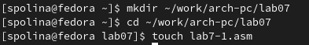{#fig:001 width=70%}

Не забываю также скопировать в созданный каталог файл in_out.asm, так как далее он будет использоваться во всех программах (рис. @fig:002).

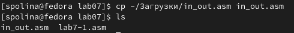{#fig:002 width=70%}

Открыла файл lab7-1.asm в GNU nano и вставила текст программы из листинга 1 (рис. @fig:003).

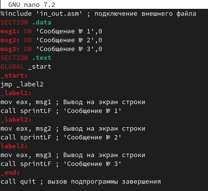{#fig:003 width=70%}

После чего я создала объектный файл программы,кампановала его и запустила код (рис. @fig:004). Благодаря команде jmp программа сразу перепрыгивает ко второму действию,игнорируя первый этап кода.

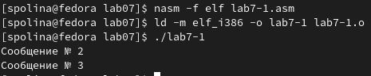{#fig:004 width=70%}

Далее я изменила текст программы в сооитветствии с листингом 2 (рис. @fig:005).

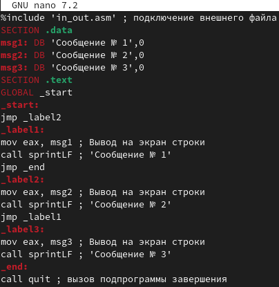{#fig:005 width=70%}

Кампановала созданный объектный файл и запустила программу (рис. @fig:006)

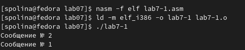{#fig:006 width=70%}

Редактирую код программы в соответствии с заданием: сначала выводится "Сообщение №3", затем "Сообщение №2", затем "Сообщение №1", для этого я использую всё ту же команду jmp (рис. @fig:007).

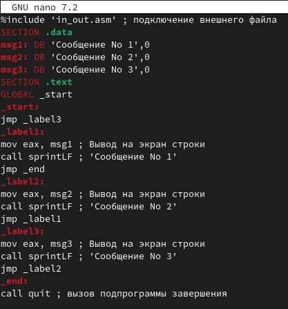{#fig:007  width=70%}

Далее я запустила программу и проверила правильность написания программы (рис. @fig:008). После я запусила программу, она выдаёт результат в правильном порядке.

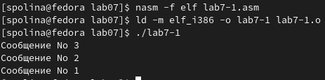{#fig:008 width=70%}

Я создала новый файл lab7-2.asm,используя утилиту touch (рис. @fig:009).

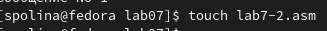{#fig:009 width=70%}

Вставила в созданный файл текст кода,скопировав листинг 7.3 (рис. @fig:010). 

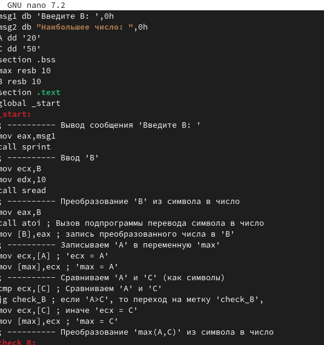{#fig:010 width=70%}

Я запустила код дважды, в первый раз я ввела число,которое меньше одной из констант, а во второй-больше (рис. @fig:011).В обоих случаях программа выдает наибольшее из трёх чисел.

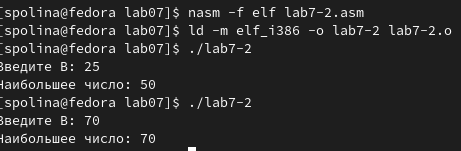{#fig:011 width=70%}

## Изучение структуры файлов листинга
Я создала файл листинга для lab7-2.asm (рис. @fig:012).

{#fig:012 width=70%}

Далее я открыла созданный файл с помощью mcedit,используя команду "mcedit lab7-2.lst" (рис. @fig:013).

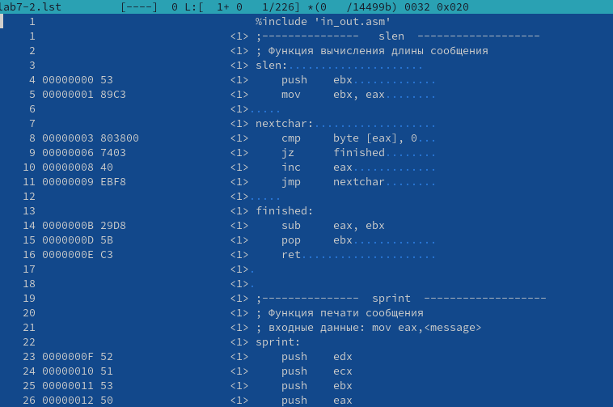{#fig:013 width=70%}

Первая строка,которую я хочу подробно описать,является строка №5 (рис. @fig:014). Первое число в строке как раз и указывает на номер строки, после чего мы можем увидеть адрес данной строки, далее у нас идет машинный код,в который ассемблируется инструкция.То есть инструкция "mov ebx,eax" ассемблируется в 89С3. В данном случае, 89С3-это инструкция на машинном языке по вызову и присваиванию регистра. После этого мы можем увидеть исходный текст программы.

{#fig:014 width=70%}

Вторая строка,которую я хочу подробно описать,является строка №11 (рис. @fig:015). Первое число в строке как раз и указывает на номер строки, после чего мы можем увидеть адрес данной строки, далее у нас идет машинный код,в который ассемблируется инструкция.То есть инструкция "jmp nextchar" ассемблируется в EBF8. В данном случае, EBF8-это инструкция на машинном языке по переходу на другую строку. После этого(в правой части) мы можем увидеть исходный текст программы.

{#fig:015 width=70%}

Третья строка,которую я хочу подробно описать,является строка №39 (рис. @fig:016). Первое число в строке(самое левое) как раз и указывает на номер строки, после чего мы можем увидеть адрес данной строки, далее у нас идет машинный код,в который ассемблируется инструкция.То есть инструкция "cmp ecx" ассемблируется в 380D. В данном случае, 380D-это инструкция на машинном языке по сравнению чисел. В квадратных скобках рядом можно увидеть адрес,который указывает на значение числа B. После этого(в правой части) мы можем увидеть исходный текст программы.

{#fig:016 width=70%}

Далее я открыла файл с программой lab7-2.asm и в инструкции с двумя операндами удалила один из них (рис. @fig:017).

{#fig:017 width=70%}

Далее выполнила трансляцию с получением файла листинга (рис. @fig:018). Транслятор выводит ошибку при ассемблировании,даже указывая на номер строки, и файл листинга не создается.

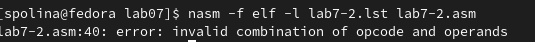{#fig:018 width=70%}

## Задания для самостоятельной работы
Я  создала файл,в котором делала первое самостоятельное задание (рис. @fig:019).

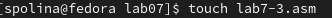{#fig:019 width=70%}

В лабораторной работе №6 мне выпал 9 вариант.Я написала программу,которая выбирает наименьшее число из трех заданных чисел.С начала выбираю меньшее из A и B, а после сравниваю его с C (рис. @fig:020). 

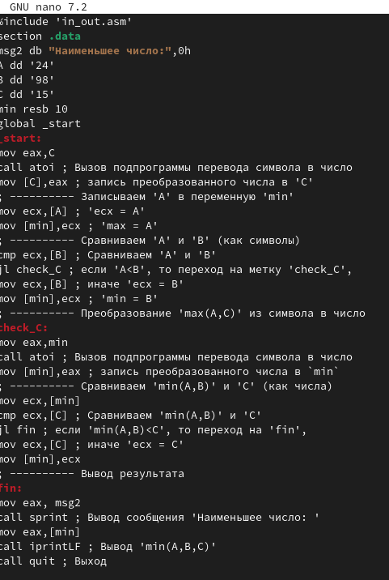{#fig:020 width=70%}

Запустила, проверила ответ и убедилась,что программа выдает наименьшее из трёх чисел (рис. @fig:021).

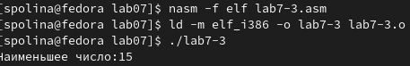{#fig:021 width=70%}

Для следующего задания создала ещё один файл lab7-4.asm (рис. @fig:022).

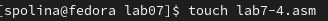{#fig:022 width=70%}

Написала программу по заданию 9 варианта (рис. @fig:023).

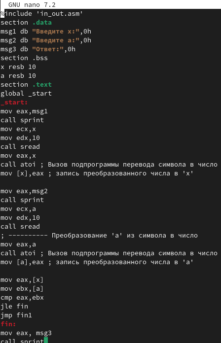{#fig:023 width=70%}

Компаную и запускаю исполняемый файл,вводя числа для первой проверки (рис. @fig:024). 
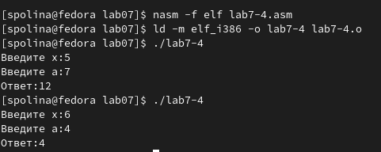{#fig:024 width=70%}

# Выводы

В этой работе я научилась работать с переходами в NASM, разобралась со структурой листинговых файлов и научилась применять эти знания для написания программ.

# Список литературы

Лабораторная работа №7.
