---
## Front matter
title: "Лабораторная работа №8"
subtitle: "Программирование
цикла. Обработка аргументов командной строки."
author: "Самарханова Полина Тимуровна"

## Generic otions
lang: ru-RU
toc-title: "Содержание"

## Bibliography
bibliography: bib/cite.bib
csl: pandoc/csl/gost-r-7-0-5-2008-numeric.csl

## Pdf output format
toc: true # Table of contents
toc-depth: 2
lof: true # List of figures
fontsize: 12pt
linestretch: 1.5
papersize: a4
documentclass: scrreprt
## I18n polyglossia
polyglossia-lang:
  name: russian
  options:
	- spelling=modern
	- babelshorthands=true
polyglossia-otherlangs:
  name: english
## I18n babel
babel-lang: russian
babel-otherlangs: english
## Fonts
mainfont: PT Serif
romanfont: PT Serif
sansfont: PT Sans
monofont: PT Mono
mainfontoptions: Ligatures=TeX
romanfontoptions: Ligatures=TeX
sansfontoptions: Ligatures=TeX,Scale=MatchLowercase
monofontoptions: Scale=MatchLowercase,Scale=0.9
## Biblatex
biblatex: true
biblio-style: "gost-numeric"
biblatexoptions:
  - parentracker=true
  - backend=biber
  - hyperref=auto
  - language=auto
  - autolang=other*
  - citestyle=gost-numeric
## Pandoc-crossref LaTeX customization
figureTitle: "Рис."
tableTitle: "Таблица"
listingTitle: "Листинг"
lofTitle: "Список иллюстраций"
lolTitle: "Листинги"
## Misc options
indent: true
header-includes:
  - \usepackage{indentfirst}
  - \usepackage{float} # keep figures where there are in the text
  - \floatplacement{figure}{H} # keep figures where there are in the text
---

# Цель работы
Приобретение навыков написания программ с использованием циклов и обработкой
аргументов командной строки.

# Задание

1. Реализация циклов в NASM
2. Обработка аргументов командной строки
3. Задание для самостоятельной работы

# Теоретическое введение

Стек — это структура данных, организованная по принципу LIFO («Last In — First Out»
или «последним пришёл — первым ушёл»). Стек является частью архитектуры процессора и
реализован на аппаратном уровне. Для работы со стеком в процессоре есть специальные
регистры (ss, bp, sp) и команды.
Основной функцией стека является функция сохранения адресов возврата и передачи
аргументов при вызове процедур. Кроме того, в нём выделяется память для локальных
переменных и могут временно храниться значения регистров.

Стек имеет вершину, адрес последнего добавленного элемента, который хранится в регистре esp (указатель стека). Противоположный конец стека называется дном. Значение,
помещённое в стек последним, извлекается первым. При помещении значения в стек указа-
тель стека уменьшается, а при извлечении — увеличивается.
Для стека существует две основные операции:
• добавление элемента в вершину стека (push);
• извлечение элемента из вершины стека (pop).

# Выполнение лабораторной работы
## Реализация циклов в NASM
Я создала директорию,в которой далее выполняла лабораторную работу (рис. @fig:001).

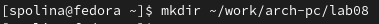{#fig:001 width=70%}

Перехожу в созданный каталог и создаю файл lab8.asm (рис. @fig:002).

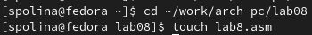{#fig:002 width=70%}

Далее я скопировала файл in_out.asm (рис. @fig:003). 

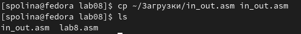{#fig:003 width=70%}

После чего я записала текст кода из листинга 8.1 (рис. @fig:004). Эта программа запрашивает число N, и выдает все числа перед N вместе с ним до 0.

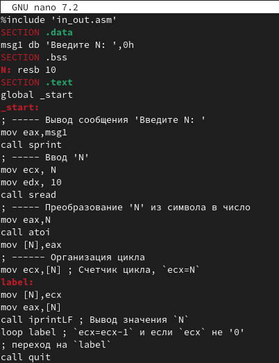{#fig:004 width=70%}

Далее я создала исполняемый код и проверила, что он работает(рис. @fig:005).

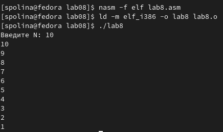{#fig:005 width=70%}

После я отредактировала код,добавив изменение значение регистра ecx в цикле (рис. @fig:006).

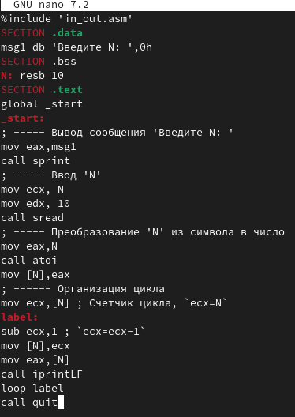{#fig:006 width=70%}

Я заапустила программу. Код стал зацикливаться и бесконечно передавать последовательные значения (рис. @fig:007).

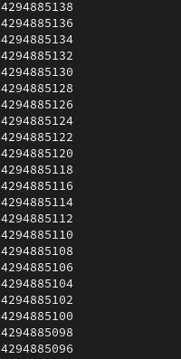{#fig:007 width=70%}

Пробую еще раз запустить программу,но с другим числом, теперь она выдаёт предыдущие числа,но перескаивает через 1 (рис. @fig:008). 

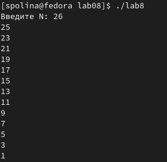{#fig:008 width=70%}

Еще раз отредактировала код программы,добавив команды push и pop для сохранения значения счетчика цикла loop (рис. @fig:009).

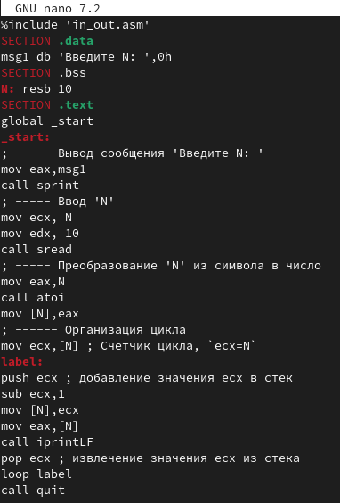{#fig:009 width=70%}

Создаю и запускаю исполняемый файл (рис. @fig:010). Теперь программа показывает все предыдущие числа до 0,не включая заданное N

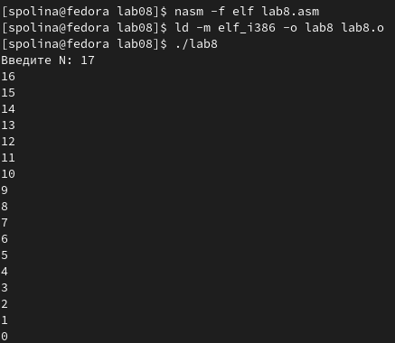{#fig:010 width=70%}

## Обработка аргументов командной строки

Далее я создала новый файл lab8-2.asm, используя команду touch (рис. @fig:011). 

{#fig:011 width=70%}

После я открыла файл в GNU nano и записала код из листинга 8.2 (рис. @fig:012). Данная программа позволяет выводить на экран аргументы командной строки.

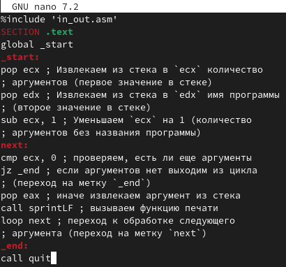{#fig:012 width=70%}

Запускаю исполняемый файл вместе с аргументами (аргумент1, аргумент2, 'аргумент3') (рис. @fig:013).

{#fig:013 width=70%}

Далее я создала новый файл lab8-3.asm, используя команду touch (рис. @fig:014). 

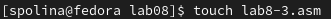{#fig:014 width=70%}

После я открыла файл в GNU nano и записала код из листинга 8.3 (рис. @fig:015). Данная программа позволяет выводить на экран сумму аргументов командной строки.

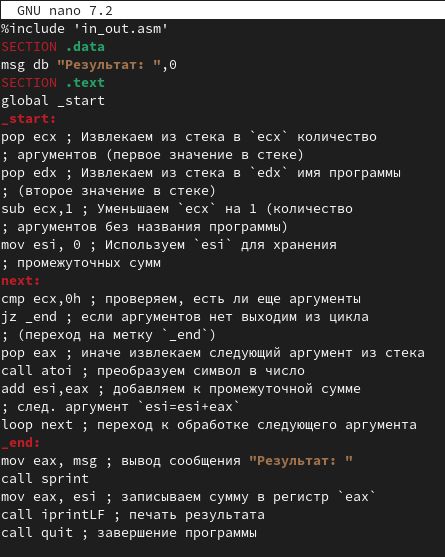{#fig:015 width=70%}

Далее я запустила исполняемый файл вместе с аргументами  (рис. @fig:016). 

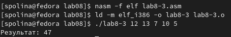{#fig:016 width=70%}

Отредактировала код программы так,чтобы она выводила произведение всех аргументов (рис. @fig:017).

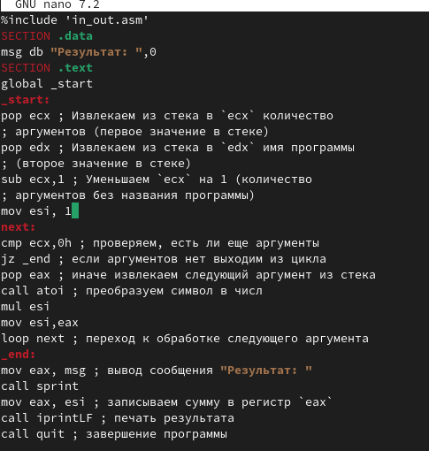{#fig:017 width=70%}

После я запустила исполняемый файл вместе с аргументами (рис. @fig:018). Программа  выдаёт произведение всех аргументов.

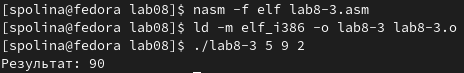{#fig:018 width=70%}

## Задание для самостоятельной работы

Я создала файл lab8-4.asm в котором написала код для последней задачи (рис. @fig:019).

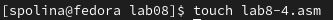{#fig:019 width=70%}

Далее написала код программы,который позволяет вывести сумму всех преобразованных аргументов из варианта  №9(рис. @fig:020).

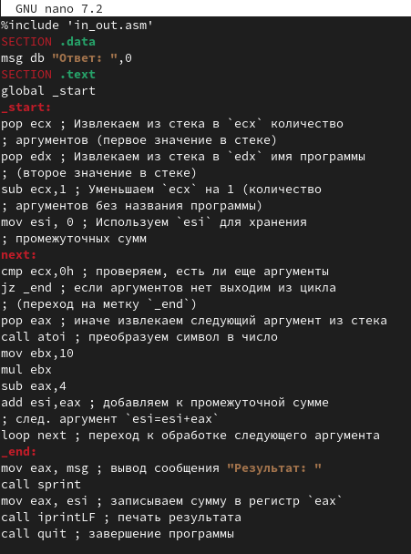{#fig:020 width=70%}

Запустила исполняемый файл (рис. @fig:021). Программа  выдала верную сумму всех преобразованных аргументов.

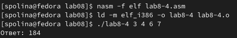{#fig:021 width=70%}

# Выводы

В данной лабораторной работать я научилась работать с циклами, выводом аргументов и функций.

# Список литературы{.unnumbered}

1. Лабораторная работа №8

