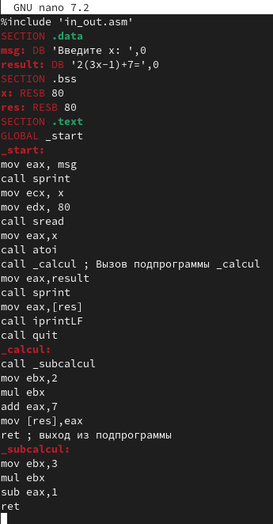
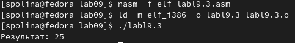

---
## Front matter
title: "Лабораторная работа №9"
subtitle: "Понятие подпрограммы"
author: "Самарханова Полина Тимуровна"

## Generic otions
lang: ru-RU
toc-title: "Содержание"

## Bibliography
bibliography: bib/cite.bib
csl: pandoc/csl/gost-r-7-0-5-2008-numeric.csl

## Pdf output format
toc: true # Table of contents
toc-depth: 2
lof: true # List of figures
fontsize: 12pt
linestretch: 1.5
papersize: a4
documentclass: scrreprt
## I18n polyglossia
polyglossia-lang:
  name: russian
  options:
	- spelling=modern
	- babelshorthands=true
polyglossia-otherlangs:
  name: english
## I18n babel
babel-lang: russian
babel-otherlangs: english
## Fonts
mainfont: PT Serif
romanfont: PT Serif
sansfont: PT Sans
monofont: PT Mono
mainfontoptions: Ligatures=TeX
romanfontoptions: Ligatures=TeX
sansfontoptions: Ligatures=TeX,Scale=MatchLowercase
monofontoptions: Scale=MatchLowercase,Scale=0.9
## Biblatex
biblatex: true
biblio-style: "gost-numeric"
biblatexoptions:
  - parentracker=true
  - backend=biber
  - hyperref=auto
  - language=auto
  - autolang=other*
  - citestyle=gost-numeric
## Pandoc-crossref LaTeX customization
figureTitle: "Рис."
tableTitle: "Таблица"
listingTitle: "Листинг"
lofTitle: "Список иллюстраций"
lotTitle: "Список таблиц"
lolTitle: "Листинги"
## Misc options
indent: true
header-includes:
  - \usepackage{indentfirst}
  - \usepackage{float} # keep figures where there are in the text
  - \floatplacement{figure}{H} # keep figures where there are in the text
---

# Цель работы
Приобретение навыков написания программ с использованием подпрограмм. Знакомство
с методами отладки при помощи GDB и его основными возможностями.

# Задание
1. Реализация подпрограмм в NASM
2. Отладка программ с помощью GDB
3. Добавление точек останова
4. Работа с данными программы в GDB
5. Обработка аргументов командной строки в GDB
6. Задание для самостоятельной работы

# Выполнение лабораторной работы
## Реализация подпрограмм в NASM
Я создала каталог для выполнения работы №9 (рис. @fig:001).

{#fig:001 width=70%}

После перещла в созданную директорию (рис. @fig:002).

{#fig:002 width=70%}

Создала файл lab09-1.asm в новом каталоге (рис. @fig:003).

{#fig:003 width=70%}

Далее я скопировала файл in_out.asm в созданный каталог(рис. @fig:004).

{#fig:004 width=70%}

После чего я открыла файл в GNU nano и переписала код программы из листинга 9.1 (рис. @fig:005).

{#fig:005 width=70%}

Далее создала объектный файл программы и после компановки запустила его (рис. @fig:006). 

{#fig:006 width=70%}

Я изменила текст файла,добавив подпрограмму sub_calcul в подпрограмму _calcul (рис. @fig:007).

{#fig:007 width=70%}

После я запустила исполняемый файл (рис. @fig:008).

{#fig:008 width=70%}

## Отладка программ с помощью GDB

Далее я создала файл lab09-2.asm, используя команду touch (рис. @fig:009).

{#fig:009 width=70%}

Записала код программы из листинга 9.2,который выводит сообщение Hello world (рис. @fig:010).

{#fig:010  width=70%}

Получила исполняемый файл. Для работы с GDB провела трансляцию программ с ключом "-g" и загрузила исполняемый файл в отладчик (рис. @fig:011).

{#fig:011 width=70%}

После я проверила работу программы  в оболоке GDB с помощью команды run (рис. @fig:012).

{#fig:012 width=70%}

Установила брейкпоинт на метку _start,с которой начинается выполнение ассемблерной программы  (рис. @fig:013).

{#fig:013 width=70%}

Далее запустила её (рис. @fig:014).

{#fig:014 width=70%}

С помощью команды "disassemble _start" я просматрела дисассимилированный код программы (рис. @fig:015).

{#fig:015 width=70%}

После я переключилась на отображение команд с Intel’овским синтаксисом, введя команду "set disassembly-flavor intel" (рис. @fig:016).

{#fig:016 width=70%}

Основное различие заключается в том,что в режиме Intel пишется сначала сама команда,а потом её машинный код, в то время как в режиме ATT идет сначала машинный код,а только потом сама команда.
 
## Добавление точек останова

Я проверила наличие точки останова с помощью команды info breakpoints (рис. @fig:017).

{#fig:017 width=70%}

Устанавила ещё одну точку останова по адресу инструкции (рис. @fig:018).

{#fig:018 width=70%}

Просматрела информацию (рис. @fig:019).

{#fig:019 width=70%}

## Работа с данными программы в GDB

Далее я просмотрела содержимое регистров с помощью команды info register (рис. @fig:020).

{#fig:020 width=70%}

Узнала значение переменной msg1 по имени (рис. @fig:021).

{#fig:021 width=70%}

После просмотрела значение переменной msg2 по адресу,который можно определить по дизассемблированной инструкции (рис. @fig:022).

{#fig:022 width=70%}

Изменила первый символ переменной msg1 (рис. @fig:023).

{#fig:023 width=70%}

Также поменяла первый символ переменной msg2 (рис. @fig:024).

{#fig:024 width=70%}

Далее я вывела значение регистра edx (рис. @fig:025).

{#fig:025 width=70%}

С помощью команды set я изменила значение регистра ebx (рис. @fig:026).

{#fig:026 width=70%}

Значение регистра отличаются,так как в первом случае мы выводим код символа 2,который в десятичной системе счисления равен 50,а во втором случае выводится число 2,представленное в этой же системе.

## Обработка аргументов командной строки в GDB

Я скопировала файл lab8-2.asm в файл с именем lab09-3.asm (рис. @fig:027).

{#fig:027 width=70%}

Создала исполняемый файл,использую ключ --args для загрузки программы в GDB. Загрузила исполняемый файл,указав аргументы (рис. @fig:028).

{#fig:028 width=70%}

Устанавила точку останова перед первой инструкцией в программе и запустила её (рис. @fig:029).

{#fig:029 width=70%}

Просмотрела адрес вершины стека, который хранится в регистре esp (рис. @fig:030).

{#fig:030 width=70%}

Ввела другие позиции стека(рис. @fig:031).

{#fig:031 width=70%}

Количество аргументов командной строки 4,следовательно и шаг равен четырем.

## Задание для самостоятельной работы

Далее я создала файл для первого самостоятельного задания lab09-4.asm (рис. @fig:032).

{#fig:032 width=70%}

После чего отредактировала код программы lab8-4.asm,добавив подпрограмму,которая вычисляет значения функции f(x) (рис. @fig:033).

{#fig:033 width=70%}

Далее я создала исполняемый файл и ввела аргументы (рис. @fig:034).

{#fig:034 width=70%}

Создала файл и ввела код из листинга 9.3 (рис. @fig:035).

{#fig:035 width=70%}

Далее я открыла файл в отладчике GDB и запускаю программу (рис. @fig:036).

{#fig:036 width=70%}

Просмотрев дисассимилированный код программы, поставила точку останова перед прибавлением 5 и открыла значения регистров на данном этапе (рис. @fig:037).

{#fig:037 width=70%}

Как можно увидеть, регистр ecx со значением 4 умножается не на ebx,сложенным c eax, а только с eax со значением 2. Значит нужно поменять значения регистров(например присвоить eax значение 3 и просто прибавит 2. После изменений программа будет выглядить следующим образом:(рис. @fig:038).

{#fig:038 width=70%}

Далее я запустила программу (рис. @fig:039).

{#fig:039 width=70%}

# Выводы

В данной работе я приобрела навыки написания программ с подпрограммами и познакомилась с методами отладки при помощи GDB.

# Список литературы{.unnumbered}

Лабораторная работа №9
