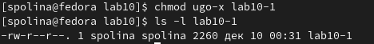
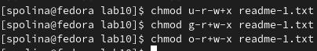

---
## Front matter
title: "Лабораторная работа №10"
subtitle: "Работа с файлами средствами NASM"
author: "Самарханова Полина Тимуровна"

## Generic otions
lang: ru-RU
toc-title: "Содержание"

## Bibliography
bibliography: bib/cite.bib
csl: pandoc/csl/gost-r-7-0-5-2008-numeric.csl

## Pdf output format
toc: true # Table of contents
toc-depth: 2
lof: true # List of figures
fontsize: 12pt
linestretch: 1.5
papersize: a4
documentclass: scrreprt
## I18n polyglossia
polyglossia-lang:
  name: russian
  options:
	- spelling=modern
	- babelshorthands=true
polyglossia-otherlangs:
  name: english
## I18n babel
babel-lang: russian
babel-otherlangs: english
## Fonts
mainfont: PT Serif
romanfont: PT Serif
sansfont: PT Sans
monofont: PT Mono
mainfontoptions: Ligatures=TeX
romanfontoptions: Ligatures=TeX
sansfontoptions: Ligatures=TeX,Scale=MatchLowercase
monofontoptions: Scale=MatchLowercase,Scale=0.9
## Biblatex
biblatex: true
biblio-style: "gost-numeric"
biblatexoptions:
  - parentracker=true
  - backend=biber
  - hyperref=auto
  - language=auto
  - autolang=other*
  - citestyle=gost-numeric
## Pandoc-crossref LaTeX customization
figureTitle: "Рис."
tableTitle: "Таблица"
listingTitle: "Листинг"
lofTitle: "Список иллюстраций"
lolTitle: "Листинги"
## Misc options
indent: true
header-includes:
  - \usepackage{indentfirst}
  - \usepackage{float} # keep figures where there are in the text
  - \floatplacement{figure}{H} # keep figures where there are in the text
---

# Цель работы
Приобретение навыков написания программ для работы с файлами.

# Задание
1. Задание лабораторной работы
2. Задание для самостоятельной работы

# Выполнение лабораторной работы

## Задание лабораторной работы

Я создала каталог для программ лабораторной работы №10, после создала - lab10-1.asm,readme-1.txt,readme-2.txt (рис. @fig:001).

{#fig:001 width=70%}

Переместила файл in_out.asm, (рис. @fig:002).

{#fig:002 width=70%}

После чего ввела в файл lab10-1.asm текст программы из листинга 10.1. Изменила название файла (рис. @fig:003).

{#fig:003 width=70%}

Далее я создала исполняемый файл,ввела сообщение,которое переместится в файл readme-1.txt, после чего распаковала данный файл и убдилась,что мое сообщение находится именно там (рис. @fig:004).

{#fig:004 width=70%}

С помощью команды chmod изменила права доступа к исполняемому файлу lab10-1, запрещая его выполнение во всех трех группах и проверила команду с помощью ls (рис. @fig:005).

{#fig:005 width=70%}

Я попробовала запустить файл, но мне отказали в доступе (рис. @fig:006).

{#fig:006 width=70%}

С помощью команды chmod я изменила права доступа к файлу lab10-1.asm с исходным текстом программы, добавляя права на исполнение для всех пользователей (рис. @fig:007).

{#fig:007 width=70%}

Совершила проверку (рис. @fig:008).

{#fig:008 width=70%}

9 вариант из таблицы (--x -w- -w-; 001 011 101) предоставляю права доступа к файлу readme-1.txt в символьном виде (рис. @fig:009). А к readme-2.asm в численном (рис. @fig:010).

{#fig:009 width=70%}

{#fig:010 width=70%}

С помощью команды ls и ключа -l проверила права у 1 файла (рис. @fig:011). И у 2 (рис. @fig:011).

{#fig:011 width=70%}

{#fig:012 width=70%}

## Задание для самостоятельной работы

Я создала новый файл lab10-2.asm для написание кода программы (рис. @fig:013).

{#fig:013 width=70%}

Пишу код программы,который работает по следующему алгоритму:
• Вывод приглашения “Как Вас зовут?”
• ввести с клавиатуры свои фамилию и имя
• создать файл с именем name.txt
• записать в файл сообщение “Меня зовут”
• дописать в файл строку введенную с клавиатуры
• закрыть файл
(рис. @fig:014)

{#fig:014 width=70%}

Далее я запустила программу и убедилась, что она работает исправно (рис. @fig:015).

{#fig:015 width=70%}

# Выводы

В данной лабораторной работе я приобрела навыки написания программ для работы с файлами.

# Список литературы{.unnumbered}

Лабораторная работа №10
